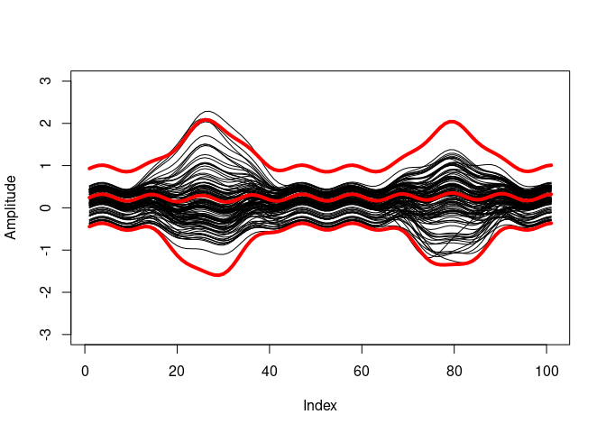

# FunBootBand

<!-- badges: start -->
<!-- badges: end -->

The `FunBootBand` package contains one function `band()`, which
generates statistical (prediction or confidence) bands from curve data
using a functional approach and bootstrapping.

At its core, this package is an implementation of the method developed
by Sutherland et al. (1988) and Olshen et al. (1989), described in
detail in Lenhoff et al. (1999). The method was originally written as a
MATLAB program by Doris Oriwol and later translated into R and extended
with an approach to handle hierarchical data (see also
<https://github.com/koda86/floa>).

For more theoretical background, see this publication:

Koska, D., Oriwol, D., & Maiwald, C. (2023). Comparison of statistical
models for characterizing continuous differences between two
biomechanical measurement systems. Journal of Biomechanics 149,
<https://doi.org/10.1016/j.jbiomech.2023.111506>.

## Citation

<!-- IMHO, the following statement makes a great point: -->
<!-- <small> "Every great open source math library is built on the ashes of someone’s academic career" – https://njt-rse-unsw.netlify.app/#24 </small> -->

Please cite the package via `citation("FunBootBand")`.

## Issues and contributing

In case you find a bug or run into other problems, please look for the
“Issues” tab. Feedback of any kind is welcome.

## Installation

You can install the development version of FunBootBand from
[GitHub](https://github.com/koda86/FunBootBand) with:

``` r
# install.packages("devtools")
devtools::install_github("koda86/FunBootBand")
```

## Example

Here’s how to use the `band()` function with the built-in data set.

``` r
library(FunBootBand)

# In the example, `B` is set to only 5 to guarantee a fast calculation.
# In reality, this value would be too low (package default: 400).
prediction.band <- band(data,
                        type = "prediction",
                        B = 5,
                        alpha = 0.05,
                        iid = TRUE)

# Function output:
rownames(prediction.band)
#> [1] "upper" "mean"  "lower"
str(prediction.band)
#>  num [1:3, 1:101] 0.746 0.132 -0.483 0.79 0.175 ...
#>  - attr(*, "dimnames")=List of 2
#>   ..$ : chr [1:3] "upper" "mean" "lower"
#>   ..$ : NULL
```

You may, i.e., print the calculated limits alongside the original
curves.

``` r
plot(data[, 1], type = "l", ylim = c(-3, 3), ylab = "Amplitude")
apply(data, 2, function(x) lines(x))
apply(prediction.band, 1, function(x) lines(x, col = "red", lwd = 4))
```



## Licence

LGPL (\>= 3)

## References

-   Lenhoff, M.W., Santner, T.J., Otis, J.C., Peterson, M.G., Williams,
    B.J., Backus, S.I., 1999. Bootstrap prediction and confidence bands:
    a superior statistical method for analysis of gait data. Gait
    Posture 9 (1), 10–17. <http://dx.doi.org/10.1016/s0966->
    6362(98)00043-5.

-   Olshen, R.A., Biden, E.N., Wyatt, M.P., Sutherland, D.H., 1989. Gait
    analysis and the bootstrap. Ann. Statist. 17 (4),
    <http://dx.doi.org/10.1214/aos/1176347372>.

-   Sutherland, D., Olshen, R., Biden, E., Wyatt, M., 1988. Development
    of Mature Walking. Mac Keith Press.
